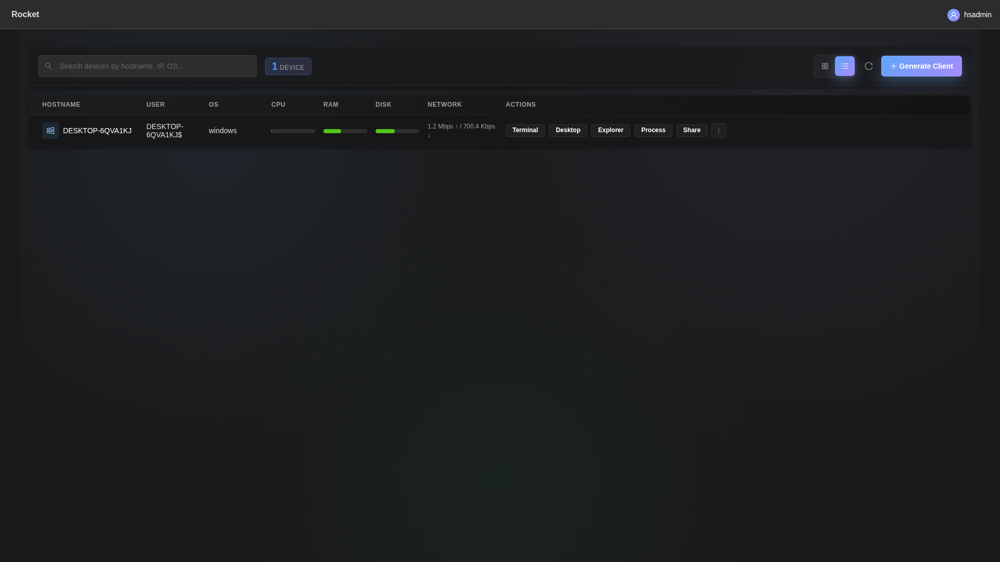
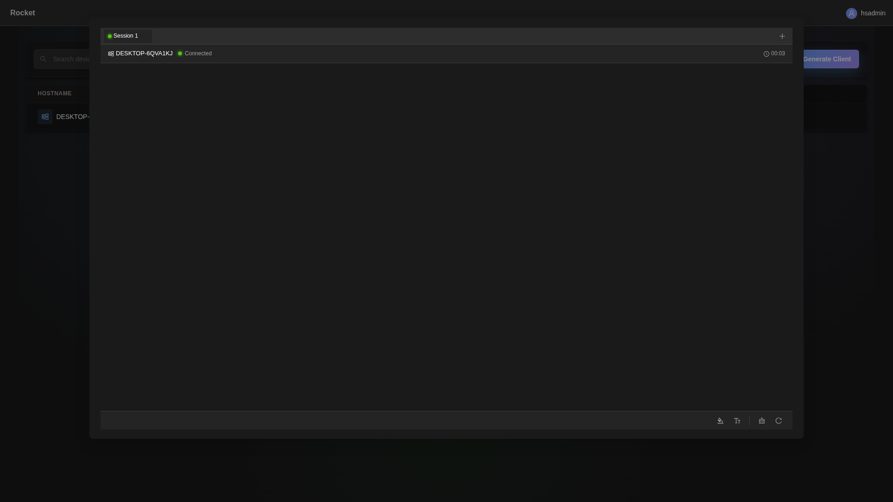
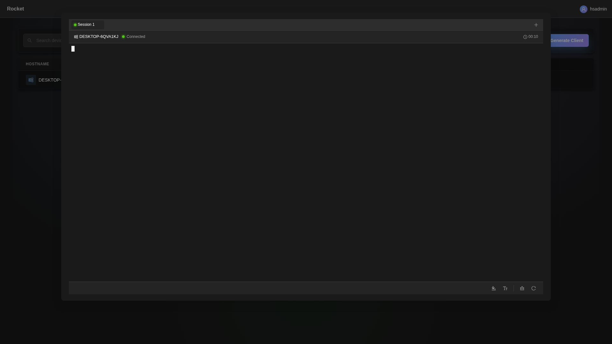

#### [English] [[中文]](./README.ZH.md) [[API Document]](./API.md) [[API文档]](./API.ZH.md)

---

<h1>Rocket</h1>

**[Rocket](https://github.com/XZB-1248/Rocket)** is a free, safe, open-source, web-based, cross-platform, and full-featured RAT (Remote Administration Tool) that allows you to control all your devices via browser anywhere.

✅ **No data collection**: Rocket does not collect any user information.  
✅ **No auto-updates**: The server will not update itself.  
✅ **Direct communication**: Clients communicate exclusively with your server.

---


|  |  |  |
|-----------------------------------------------------------------------------------------------|-----------------------------------------------------------------------------------------|-------------------------------------------------------------------------------------------------------|

| [](https://github.com/XZB-1248/Rocket/releases) | [](https://github.com/XZB-1248/Rocket/releases/latest) |
|---------------------------------------------------------------------------------------------------------------------------------------------------|--------------------------------------------------------------------------------------------------------------------------------------------------------------------------------|

---

## ⚠️ Disclaimer

**THIS PROJECT, ITS SOURCE CODE, AND RELEASES SHOULD ONLY BE USED FOR EDUCATIONAL PURPOSES.**

❌ **Illegal usage is strictly prohibited.**  
❌ **Authors and developers are not responsible for any misuse.**  
✅ **Use it at your own risk.**

If you find security vulnerabilities, **do not open an issue**. Contact me immediately via [email](mailto:i@1248.ink).

---

## 🚀 Quick Start

### Binary Execution

1. Download the executable from the [releases](https://github.com/XZB-1248/Rocket/releases) page.
2. Follow the [Configuration](#configuration) instructions.
3. Run the executable and access the web interface at `http://IP:Port`.
4. Generate a client and run it on the target device.
5. Start managing your devices!

---

## ⚙️ Configuration

The configuration file `config.json` should be in the same directory as the executable.

**Example:**

```json
{
    "listen": ":8000",
    "salt": "123456abcdef123456", 
    "auth": {
        "username": "password"
    },
    "log": {
        "level": "info",
        "path": "./logs",
        "days": 7
    }
}
```

### Main Parameters:
- **`listen`** (required): Format `IP:Port`.
- **`salt`** (required): Max length 24 characters. After modification, all clients need to be regenerated.
- **`auth`** (optional): Authentication credentials (`username:password`).
  - Hashed passwords are recommended (`$algorithm$hashed-password`).
  - Supported algorithms: `sha256`, `sha512`, `bcrypt`.
- **`log`** (optional): Logging configuration.
  - `level`: `disable`, `fatal`, `error`, `warn`, `info`, `debug`.
  - `path`: Log directory (default: `./logs`).
  - `days`: Log retention days (default: `7`).

### WebRTC / ICE Configuration

Add STUN/TURN lists to help WebRTC connections, especially when clients are behind NAT:

```json
"webrtc": {
  "turn_servers": [
    "turn:turn.example.com:3478?transport=udp"
  ],
  "stun_servers": [
    "stun:stun.l.google.com:19302",
    "stun:stun.cloudflare.com:3478"
  ]
}
```

- Server reads these lists to send to browsers; clients also honor `SPARK_WEBRTC_TURN`, `SPARK_WEBRTC_STUN`, `SPARK_WEBRTC_TURN_USERNAME`, and `SPARK_WEBRTC_TURN_PASSWORD` env vars (comma-separated URLs) when present.
- Default desktop streaming uses built-in JPEG/RAW codecs only (no external DLLs or drivers needed). Optional VP8/VP9/H.264 hardware paths require custom builds with the appropriate SDKs/libs; the stock binaries do not depend on them.

---

## 🔒 HTTPS/TLS Deployment

Rocket supports native HTTPS with manual certificates or automatic Let's Encrypt certificates.

### Option 1: Manual Certificates

**Command Line:**
```bash
./rocket-server -tls -tls-cert /path/to/cert.pem -tls-key /path/to/key.pem -listen :443
```

**Config File:**
```json
{
    "listen": ":443",
    "salt": "your-salt",
    "tls": {
        "enable": true,
        "cert": "/path/to/cert.pem",
        "key": "/path/to/key.pem"
    }
}
```

### Option 2: Let's Encrypt (Automatic)

**Command Line:**
```bash
./rocket-server -tls-autocert -tls-domains "rocket.yourdomain.com" -tls-email "you@example.com" -listen :443
```

**Config File:**
```json
{
    "listen": ":443",
    "salt": "your-salt",
    "tls": {
        "autocert": {
            "enable": true,
            "domains": ["rocket.yourdomain.com"],
            "email": "you@example.com",
            "cache_dir": "./certs"
        }
    }
}
```

### TLS Command Line Flags

| Flag | Description |
|------|-------------|
| `-tls` | Enable TLS/HTTPS with manual certificates |
| `-tls-cert` | Path to TLS certificate file |
| `-tls-key` | Path to TLS private key file |
| `-tls-autocert` | Enable automatic Let's Encrypt certificates |
| `-tls-domains` | Comma-separated list of domains for autocert |
| `-tls-email` | Email for Let's Encrypt notifications |
| `-tls-cache` | Directory to cache certificates (default: `./certs`) |

> For the production `gapict.com` deployment, follow `docs/TLS_SETUP.md` to reproduce the DNS, firewall, and validation steps used to keep the real certificate healthy.

**Notes:**
- With autocert, an HTTP server on port 80 handles ACME challenges and redirects to HTTPS
- Certificates are cached in the `cache_dir` directory and renewed automatically
- No client code changes needed - clients connect via `wss://` automatically when using HTTPS

---

## 🛠️ Features

| Feature/OS        | Windows | Linux | MacOS |
|-------------------|---------|-------|-------|
| Process Manager   | ✔       | ✔     | ✔     |
| Kill Process      | ✔       | ✔     | ✔     |
| Network Traffic   | ✔       | ✔     | ✔     |
| File Explorer     | ✔       | ✔     | ✔     |
| File Transfer     | ✔       | ✔     | ✔     |
| File Editor       | ✔       | ✔     | ✔     |
| Delete File       | ✔       | ✔     | ✔     |
| Code Highlighting | ✔       | ✔     | ✔     |
| Desktop Monitor   | ✔       | ✔     | ✔     |
| Screenshot        | ✔       | ✔     | ✔     |
| OS Info           | ✔       | ✔     | ✔     |
| Remote Terminal   | ✔       | ✔     | ✔     |
| * Shutdown        | ✔       | ✔     | ✔     |
| * Reboot          | ✔       | ✔     | ✔     |
| * Log Off         | ✔       | ❌     | ✔     |
| * Sleep           | ✔       | ❌     | ✔     |
| * Hibernate       | ✔       | ❌     | ❌     |
| * Lock Screen     | ✔       | ❌     | ❌     |

🚨 **Functions marked with * may require administrator/root privileges.**

---

## 📸 Screenshots

  
  
  
  
  
  


---

## 🔧 Development

### Components
This project consists of three main components:
- **Client**
- **Server**
- **Front-end**

For OS support beyond Linux and Windows, additional C compilers may be required. For example, to support Android, install [Android NDK](https://developer.android.com/ndk/downloads).

### Build Guide

```bash
# Clone the repository
git clone https://github.com/XZB-1248/Rocket
cd ./Rocket

# Build the front-end
cd ./web
npm install
npm run build-prod

# Embed static resources
cd ..
go install github.com/rakyll/statik
statik -m -src="./web/dist" -f -dest="./server/embed" -p web -ns web

# Build the client
mkdir ./built
go mod tidy
go mod download
./scripts/build.client.sh

# Build the server
mkdir ./releases
./scripts/build.server.sh
```

### Client Configuration Trailer

Rocket uses a **binary trailer approach** (Sliver-style) for embedding client configuration into executables. This design works identically across Windows, Linux, and macOS, providing a robust and maintainable solution.

**Key Benefits:**
- **Platform-Independent**: Works with PE, ELF, and Mach-O formats using identical code
- **Immutable Templates**: Base binaries remain unchanged and can be code-signed
- **Simple & Reliable**: No complex binary patching or compiler-dependent placeholders
- **Single-File Distribution**: Self-contained executables with embedded config

**Format Overview:**
```
[Original Binary] → [384-byte Encrypted Config Payload] → [20-byte Footer]
```

The footer contains:
- Magic: `SPARKCFG` (8 bytes) - Identifier
- Version: `1` (uint16) - Format version
- Reserved: `0` (uint16) - Future use
- Length: `384` (uint32) - Payload size
- CRC32: Checksum (uint32) - Integrity verification

Each client binary receives a unique AES-encrypted configuration with randomly generated credentials. The client reads this trailer at runtime to discover its server, port, and authentication keys.

**For detailed technical documentation**, see [TRAILER_FORMAT.md](./TRAILER_FORMAT.md) which covers:
- Complete binary format specification
- Encryption and security details
- Generation and reading workflows
- Cross-platform compatibility
- Comparison with alternative approaches

**Important:** Clean templates in `releases/built` must remain trailer-free. Configuration is appended only during client generation or updates.

## Custom Features

If you need to customize some features, please contact me via [**i@1248.ink**](mailto:i@1248.ink).

---

## Dependencies

Rocket contains many third-party open-source projects.

Lists of dependencies can be found at `go.mod` and `package.json`.

Some major dependencies are listed below.

### Back-end

* [Go](https://github.com/golang/go) ([License](https://github.com/golang/go/blob/master/LICENSE))

* [gin-gonic/gin](https://github.com/gin-gonic/gin) (MIT License)

* [imroc/req](https://github.com/imroc/req) (MIT License)

* [kbinani/screenshot](https://github.com/kbinani/screenshot) (MIT License)

* [shirou/gopsutil](https://github.com/shirou/gopsutil) ([License](https://github.com/shirou/gopsutil/blob/master/LICENSE))

* [gorilla/websocket](https://github.com/gorilla/websocket) (BSD-2-Clause License)

* [orcaman/concurrent-map](https://github.com/orcaman/concurrent-map) (MIT License)

### Front-end

* [React](https://github.com/facebook/react) (MIT License)

* [Ant-Design](https://github.com/ant-design/ant-design) (MIT License)

* [axios](https://github.com/axios/axios) (MIT License)

* [xterm.js](https://github.com/xtermjs/xterm.js) (MIT License)

* [crypto-js](https://github.com/brix/crypto-js) (MIT License)

### Acknowledgements

* [natpass](https://github.com/lwch/natpass) (MIT License)
* Image difference algorithm inspired by natpass.

[](https://vps.town "VPS.Town - Trust, Effortlessly. Your Cloud, Reimagined.")
[](https://dartnode.com "Powered by DartNode - Free VPS for Open Source")

---

### Stargazers over time

[](https://starchart.cc/XZB-1248/Rocket)


---

## 📈 Observability

- Server tracing is opt-in via OTLP: set `OTEL_EXPORTER_OTLP_ENDPOINT` (and optionally `SPARK_TRACE_SAMPLE_RATIO`, `OTEL_EXPORTER_OTLP_HEADERS`, `OTEL_EXPORTER_OTLP_INSECURE=true`).
- HTTP spans are instrumented with `otelgin`; server logs now include `trace_id`/`span_id` when present.
- Agents expose `/metrics`, `/health`, `/ready` on `:9090` when running as a service.
- Use the reference collector config at `observability/otel-collector.yaml` and the guide in `docs/observability.md` to ship logs (server, agent, Caddy), traces (OTLP), and metrics (Prometheus/remote_write) to your stack.

---

## 📜 License

Distributed under the [BSD-2 License](./LICENSE).
