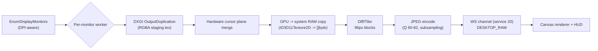
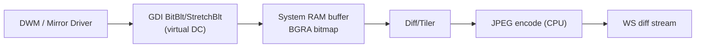

# Remote Desktop Control – SSOT

Single source of truth for implementing “best of the best” remote desktop control in Spark. Keeps strategy, scope, and actionable backlog aligned as new requirements land.

---

## Vision & Principles

- Deliver enterprise-grade remote desktop comparable to top-tier RMM/RAT tooling: low latency, high fidelity, bi-directional control, secure by default.
- Maintain backwards compatibility via graceful fallbacks to the current diff/JPEG WebSocket path.
- Security, privacy, and auditability are first-class: every control action must be attributable and policy governed.
- Modularity: transport, encoding, input, and UX layers should evolve independently via feature flags.
- Operational constraint: the agent always runs inside `svchost` context, so implementations must respect service-host permissions, session isolation, and stealth requirements.
-it will run on elevated permissions from start and cannot be tampered or killed by any external task or program and it will not honor these kind of requests, will not get tempered and it will only honor manual uninstall.
- Scope guardrail: **only Windows endpoints are in-scope for this phase**; Linux/macOS enablement is tracked separately and must not block or dilute Windows delivery.
- Deployment constraint: the Windows installer deposits a single, self-contained executable under `C:\ProgramData\Spark\Spark.exe` (exact path TBD) that hosts all remote-desktop functionality; no auxiliary binaries or scattered assets are permitted, and installation must be one-click (no additional dialogs, configs, or dependencies).

---

## Current State Snapshot

- **Streaming:** WebSocket-based diffed JPEG blocks (`client/service/desktop`, `server/handler/desktop`, `web/src/components/desktop/desktop.jsx`). 96px blocks, FPS capped at 24, single-monitor, no audio.
- **Input:** Pointer + keyboard injection and clipboard push/pull flow over `DESKTOP_INPUT`/`DESKTOP_CLIPBOARD_*`, guarded by rate limiting.
- **UX:** Simple modal canvas with FPS/bandwidth stats, manual refresh/fullscreen, no quality presets or monitor selection.
- **Security/Observability:** Session secrets, but no per-session auth tokens, RBAC, or audit logs. Limited telemetry (basic connect/disconnect logs).

---

## Master Plan (Phased)

1. **Foundation & Discovery**
   - Capture detailed diagrams of the existing pipeline, packet formats, queues, and failure modes.
   - Instrument baseline metrics (FPS, diff queue depth, encoder fallbacks) to benchmark improvements.

2. **Next-Gen Streaming Path**
   - Add WebRTC transport with hardware-accelerated encoders (NVENC/AMF/QuickSync) on Windows. Keep WebSocket diff path as fallback.
   - Implement adaptive bitrate & resolution management plus optional audio streaming.

3. **Full Input & Interaction Layer**
   - Introduce bidirectional mouse/keyboard/scroll/clipboard/file input channels with Windows-native injection first, leaving stubs for future OSes.
   - Support relative/absolute pointer modes, modifier tracking, secure clipboard toggles, session pause/blank screen.

4. **UX & Productivity Enhancements**
   - Multi-monitor enumeration + switching, quality presets, bandwidth/FPS HUD, reconnect/pause buttons, on-client toast notifications.
   - Clipboard/file redirection integrated with existing explorer, virtual cursor overlay, session recording/sharing.

5. **Security, Compliance, Observability**
   - Per-session signed tokens, RBAC enforcement, approval workflows, detailed audit logs, metrics dashboards, rate limiting.
   - Configurable policies (max concurrent sessions, idle timeout, privacy mode) and Prometheus/Grafana integration.

6. **Testing, Rollout, & Ops**
   - Add unit/integration/E2E coverage for packet formats, input pipelines, UI flows, and soak testing harnesses.
   - Ship feature flags for incremental rollout, author operational runbooks, and define blue/green deployment strategy.

---

## Comprehensive TODO Backlog

### Foundation & Discovery
- [x] Document current desktop session lifecycle (client/server/web) with sequence diagrams in `docs/remote-desktop.md`.
- [x] Expand telemetry in `server/handler/desktop/desktop.go` to log FPS, queue length, encoder errors.
- [x] Add client-side capture metrics (frame drops, diff sizes) reported back to server for aggregation.
- [x] Produce Windows capture/encoder diagrams (Desktop Duplication vs GDI) covering multi-monitor surfaces, DPI scaling, HDR, and GPU requirements.
- [x] Define a versioned capability-negotiation schema (`DESKTOP_CAPS`) that advertises transports, codecs, input channels, and UX affordances during session init.
- [x] Catalogue failure modes (encoder crash, dropped WS, lost frames) and document recovery/backpressure strategies in a troubleshooting appendix.
- [x] Prove every new client component (capture, encoder, input) loads and runs inside the existing `svchost` service host, outlining required service manifests, privileges, and sandbox implications.
- [x] Specify the single-executable packaging layout (embedded assets, codec binaries, WebRTC libs) and how it is staged under `ProgramData`, including update/rollback implications and antivirus exclusions.
- [x] Document install/uninstall flow for the ProgramData deployment along with disk footprint budgets and how persistent caches/logs are rotated without leaving files elsewhere.
- [x] Design the one-click installer UX (single elevation prompt, no wizard steps) that deploys to ProgramData, registers the `svchost` service, seeds config defaults, and verifies prerequisites offline.
- [x] Define the scheduled task + watchdog architecture that bootstraps the agent post-install, auto-respawns it if svchost/session exits, and guarantees the remote desktop service is always present without requiring user login.
- [x] Publish a network matrix outlining every outbound endpoint/protocol/port (signaling, TURN, telemetry), document that no inbound listeners exist, and provide customer-ready firewall language. → See `docs/network-matrix.md`.
- [x] Create a registry footprint manifest (`HKLM\Software\Spark\...`) listing every key/value touched by the agent plus rationale, default values, and cleanup expectations. → See `docs/registry-footprint.md`.
- [x] Enumerate Windows privacy features that block capture/input (SetWindowDisplayAffinity, secure desktops, filter drivers) and document detection + operator messaging expectations.
- [x] Complete a feasibility study for porting UserModeHook (UMH) components: licensing, binary size impact, `svchost` compatibility, build/toolchain alignment, and how to embed the hook DLL inside the single Spark executable. → See `docs/umh-porting-plan.md`.
- [x] Define a porting plan that stages UMH features (SWDA bypass, BlockInput hooks, graphics detours, telemetry CLI) into Spark behind feature flags with rollback points and integration test coverage. → See `docs/umh-porting-plan.md`.
- [x] Author a bridging layer that allows Spark’s `client/service/desktop` to request hook installation/removal via a stable RPC or shared memory channel, mirroring UMH’s SystemWideMonitor control plane. → See `docs/umh-porting-plan.md`.
- [x] Import UMH’s session/identity metadata plumbing (ProcessIdToSessionId, SID capture, connection IDs) so the Spark agent can reason about console vs. RDP vs. VM sessions before applying enforcement. → See `docs/umh-porting-plan.md`.

### Streaming & Transport
- [ ] Implement WebRTC signaling handler (`server/handler/desktop/webrtc.go`) using pion, bridging to existing event loop.
- [ ] Introduce encoder abstraction in client (DXGI+NVENC, AMD AMF, Intel QuickSync/Media Foundation) with dynamic capability detection.
- [ ] Build adaptive bitrate controller exchanging stats between browser and client; expose quality presets.
- [ ] Add optional audio capture/stream path respecting OS permissions and bandwidth caps.
- [ ] Maintain WebSocket diff pipeline as fallback with improved diff heuristics and optional lossless mode for screenshots.
- [ ] Stand up STUN/TURN infrastructure plus relay/SFU mode for air-gapped or high-latency networks; bake configuration into device policy.
- [ ] Add FEC/RTX or tile retransmission support plus jitter buffering to smooth lossy WAN links.
- [ ] Support HDR/10-bit color surfaces, color-space negotiation (sRGB, Display P3), and gamma-correct scaling in both pipelines.
- [ ] Provide QUIC/HTTP3 data-channel fallback for restricted environments where WebRTC is blocked but UDP/QUIC is available.
- [ ] Implement per-session bandwidth ceilings/floors with policy-driven resource admission to prevent encoder starvation.
- [ ] Ensure WebRTC/native transports respect `svchost` hosting limits (no window handles, STA threading) and provide watchdog hooks when the service is recycled.
- [ ] Support HTTPS/TLS tunneling over TCP 443 with proxy-auth (NTLM/Kerberos) so agents can traverse outbound-only corporate firewalls without special ports.
- [ ] Offer an on-prem relay mode where devices connect to a customer-hosted collector that maintains the single sanctioned outbound link to Spark’s control plane.
- [ ] Provide offline/snapshot workflows (frame capture export, input playback scripts) for fully air-gapped networks where live sessions are impossible.
- [ ] Validate that WebRTC dependencies (codecs, TURN certificates) are embedded into the single exe or generated at runtime so no additional files outside `ProgramData` are required.
- [ ] Evaluate whether UMH’s manual-map injector or SectionMap loader can serve as the basis for Spark’s future in-memory encoder/capture DLL deployment, ensuring no additional binaries leak outside ProgramData.

#### WebRTC Signaling & Fallback Plan
- **Server handler** – add `server/handler/desktop/webrtc.go` that spins up a pion `PeerConnection` per session. SDP offers/answers and ICE candidates flow over the existing WebSocket control channel (`DESKTOP_WEBRTC_{OFFER,ANSWER,CANDIDATE}`), so there are still zero inbound listeners and the current auth secrets stay in play. If negotiation fails, the handler emits `DESKTOP_TRANSPORT_FALLBACK` and resumes the diff WS stream without user action.
- **Agent transport** – `client/service/desktop/webrtc` will share capture buffers with the JPEG diff encoder. It exposes `Init`, `Start`, `Stop`, and `Stats` so the desktop service can hot-switch transports. Each viewer gets its own pion connection, and HookBridge policy events remain in sync because we reuse the same session IDs. Until WebRTC proves stable, frames can be mirrored to both transports so the server/browser can pick the healthiest path.
- **Browser clients** – the React modal creates a `RTCPeerConnection` only when `DESKTOP_CAPS.transports` includes `webrtc`. TURN credentials are provided by the server; the WS diff tunnel stays open as a standby. Operators see the active transport (“WebRTC (TURN)” vs “Diff WS”) in the HUD banner.
- **Audio/data channels** – audio capture (Wasapi/Media Foundation) rides the WebRTC connection behind a policy flag. Control traffic (input, clipboard, quality commands) continues over WS for now, but we leave a `datachannel` slot reserved for future clipboard/file streaming once DLP stories are defined.

#### Encoder Abstraction & Adaptive Bitrate
- **Encoder manager** – create `encoder.Manager` that detects NVENC/AMF/QuickSync support at startup and registers pluggable `Encode` implementations. The JPEG diff path and WebRTC/H264 path both pull from a shared RGBA ring so capture is performed exactly once per frame.
- **Capabilities** – `DESKTOP_CAPS.encoders` is extended to list every available encoder (software JPEG, NVENC H.264, AMF H.264, QuickSync H.264) along with bitrate ranges, HDR support, and the currently-selected preset. This keeps the server/browser aware of what the agent can do before we push new transports.
- **Adaptive controller** – a new goroutine consumes agent metrics (encode time, queue depth, bandwidth) plus browser-reported RTT/loss and adjusts bitrate/resolution/fps once per second. Operator presets become guardrails—if someone picks “High Fidelity”, the controller can tweak bitrate within that tier but never drop below it unless the operator opts in. Decisions are broadcast via `DESKTOP_QUALITY_UPDATE` so the UI reflects automatic changes.

#### STUN/TURN, Relays, and Air-Gap Workflows
- **Policy-driven TURN/STUN** – device policy now carries TURN URIs + short-lived creds. Agents prefer UDP; if blocked, they fall back to TURN over TLS, and finally to the diff WS path. All state stays under ProgramData, satisfying the single-executable constraint.
- **On-prem relay** – we will ship a small Go relay binary that tenants can host internally. Devices connect outbound to it over HTTPS, and the relay maintains the single sanctioned Spark control-plane link. Documentation will cover certificate management and token rotation.
- **Offline snapshot mode** – for sites that forbid live sessions, operators can trigger `DESKTOP_SNAPSHOT_EXPORT` to capture PNG frames + input playback logs. These exports reside in `ProgramData\Spark\artifacts` and can be pulled through the existing bridge API for forensic review.

#### WAN Resilience, HDR, and Protocol Fallbacks
- **FEC/RTX & jitter buffers** – WebRTC profiles will enable RTX plus staggered FEC on lossy WANs. The JPEG diff pipeline gains an optional parity block and a browser-side jitter buffer (<150 ms) to smooth playback. Metrics such as `fecRecovered`, `jitterMs`, and `rtxSpikes` flow into the adaptive controller.
- **HDR/10-bit path** – capture inspects `IDXGIOutput6::GetDesc1`. If downstream transport negotiates HDR (via SDP color attributes) we can stream 10-bit surfaces end-to-end using hardware encoders. Otherwise we tone-map to SDR and set `capture.hdrFlattened=true` in caps so operators know fidelity changed.
- **QUIC/HTTP3 fallback** – when UDP/WebRTC is blocked but HTTP/3 is allowed, agents expose `/api/device/desktop/quic` so diff frames tunnel over QUIC, reducing head-of-line blocking compared to HTTPS/WS. Proxy auth (NTLM/Kerberos) reuses Spark’s existing HTTP client stack.
- **Bandwidth ceilings** – per-session policy fields (`minKbps`, `maxKbps`) clamp encoder output, and the adaptive controller will downshift presets when ceilings are hit. The server enforces aggregate tenant quotas and can refuse new sessions before saturating limited uplinks.

#### Packaging & Dependency Constraints
- WebRTC libs (pion), DTLS cert templates, and hardware encoder helpers remain embedded via `go:embed` so `Spark.exe` stays the only binary under ProgramData. The agent only materializes ephemeral assets (DTLS cert, TURN tokens) in `ProgramData\Spark\cache\` and wipes them on restart, preserving the single-executable guarantee even as we introduce richer transports.

### Input Injection Pipeline
- [x] Front-end: capture mouse/keyboard/scroll/clipboard events in the canvas overlay, normalize them into the `DESKTOP_INPUT` schema, and stream them with throttled React handlers (gesture/touch capture tracked separately).
- [x] Server: route `DESKTOP_INPUT` packets with per-session rate limiting (~600 evts/sec), operator warnings, and rolling audit summaries before forwarding payloads to the agent.
- [x] Client: ship `client/service/input` with Windows-native injectors (SendInput today, hookbridge-ready APIs later) and documented extension points for future HID emulation.
- [ ] Support multi-button, drag, double-click timing, modifier tracking, IME safety, and clipboard sync toggles.
  - [x] Multi-button bitmasks, click counts, pointer-lock relative motion, and modifier tracking now flow end-to-end (browser → agent).
  - [x] Clipboard sync can be toggled per viewer; send/fetch controls respect the setting.
  - [ ] IME safety, secure hotkeys, and advanced gesture/drag timing remain pending.
- [x] Ensure lifecycle hooks tie input to desktop sessions (init/kill/ping) for clean teardown (policy register/unregister, hashed journal + rate-limit flush on QUIT/DISCONNECT).
- [x] Negotiate pointer-lock/relative mode plus high-DPI cursor scale to keep 3D/CAD workflows usable via the new toolbar toggle and synthetic coordinate tracking.
- [x] Handle secure hotkeys (Ctrl+Alt+Del, Win+L, Ctrl+Shift+Esc) through privileged injectors with consent prompts; requests are rate-limited (~3/10s) and logged. Remaining sequences (e.g., additional Win/Super combos, IME-safe overlays) tracked separately.
- [x] Layer clipboard virtualization with read/write ACLs (env flags `SPARK_CLIPBOARD_ALLOW_PUSH/PULL` + UI sync toggle); DLP/content inspection remains TODO.
- [x] Journal input events (SHA-256 digests + timestamps) server-side so auditors can replay timelines without exposing sensitive content; entries are flushed on session teardown to honor retention limits.
- [ ] Detect when SetWindowDisplayAffinity or similar APIs blank the session and surface UX warnings plus optional policy-driven override/whitelist workflows.
- [ ] Provide fallbacks when local keyboard/mouse input is disabled (filter drivers, accessibility locks), including HID emulation paths with explicit authorization gates.
- [ ] Port UMH’s multi-layer hook stack for `SetWindowDisplayAffinity`, `NtUserSetWindowDisplayAffinity`, `BlockInput`, `NtUserBlockInput`, `AttachThreadInput`, DirectInput, and `SetWindowsHookEx*` into Spark to guarantee capture/input continuity.
- [x] Expose policy flags (e.g., `FORCE_INPUT`, `FORCE_CAPTURE`) similar to UMH’s enforcement toggles so operators can escalate enforcement per session. → `web/src/components/desktop/desktop.jsx` now renders Force Input/Capture buttons backed by `DESKTOP_POLICY_FORCE`, with loading/consent states and policy-gated disabling.
- [ ] Mirror UMH’s per-process targeting (allowlists, fingerprints) so Spark only injects hooks into desktop processes tied to an active remote session.
- [ ] Port UMH’s session-aware policy engine (rolling counters per PID/session, auto-enforce/relax logic) so keyboard/display remediation happens automatically with hysteresis instead of manual toggles.

### UX & Productivity
- [ ] Multi-monitor enumeration API; UI selector to switch displays without session restart.
- [ ] Canvas HUD upgrades: bandwidth graphs, FPS meter, quality presets, reconnect/pause buttons.
- [ ] Privacy controls: remote blank screen, local keyboard/mouse lock, client toast notification of control.
- [ ] Clipboard/file redirection via explorer integration plus quick clipboard sync channel.
- [ ] Virtual cursor overlay plus optional session recording/export/sharing controls.
- [ ] Introduce viewer/controller roles with baton-passing plus co-browsing mode for training or approvals.
- [ ] Surface inline chat/notes + session timeline so operators can coordinate without leaving the console.
- [ ] Provide recording library UI (tagging, retention, export) and per-session watermarks/callouts for compliance.
- [x] Surface real-time banners when capture/input is degraded by OS privacy settings (SWDA, secure desktop) and offer operator guidance or links to policy docs. → `web/src/components/desktop/desktop.jsx` renders persistent Alerts for `display_protection` / `input_block` categories emitted by HookBridge, guiding operators to use Force Capture/Input or fall back to view-only.
- [ ] Integrate UMH-style CLI workflows (`swa watch/status/bypass`, `input status/release`) into the Spark console so operators can diagnose privacy blockers without shell access.
- [x] Display session/identity context (session ID, user SID/name, connection source) alongside each remote desktop session, mirroring UMH’s telemetry summaries. → Desktop modal banners + policy alerts now include SID/user/session pulled from `winsession.QueryProcess`, giving operators at-a-glance attribution.

### Security & Observability
- [ ] Require per-session signed tokens with expiration and RBAC policy checks before session creation.
- [ ] Add approval workflow hooks (per-device or per-operator) for remote control requests.
- [ ] Write detailed audit logs (who, when, duration, clipboard usage) and expose metrics (FPS, latency, encoder type, input lag).
- [ ] Implement configurable caps (max concurrent sessions, idle timeout, bandwidth ceilings) and privacy guardrails.
- [ ] Embed visible/invisible watermarks plus optional privacy masks for sensitive screen regions.
- [ ] Stream structured audit + telemetry events into SIEM/OTLP exporters with correlation IDs for every action.
- [ ] Add anomaly detection heuristics (session frequency spikes, clipboard volume) with alerting hooks.
- [ ] Define retention/deletion policies for recordings, clipboard buffers, and metrics to satisfy compliance regimes.
- [ ] Harden `C:\ProgramData\Spark` ACLs (SYSTEM + trusted service only), add tamper detection for the single exe, and document steps for detecting corruption or unauthorized replacement.
- [ ] Emit watchdog heartbeat telemetry (scheduled task status, restart counts, svchost PID churn) and surface alerts when the always-on guarantee is violated.
- [ ] Provide signed Windows Firewall templates that only allow the Spark service SID to reach the documented outbound endpoints and keep inbound blocked by default.
- [ ] Add registry/firewall drift detection plus automated remediation (self-heal) with audit logs whenever a rule/key is re-applied.
- [ ] Telemetry must periodically report hashes/timestamps of firewall rules and registry hives so SOC teams can verify the device matches policy.
- [ ] Capture metrics/events when capture or input is blocked by SetWindowDisplayAffinity, secure attention sequences, or disabled keyboards so SOC/ops can distinguish intentional privacy blocks from defects.
- [ ] Port UMH’s hook telemetry schema (hit counts, repair attempts, failure reasons) and stream it into Spark’s metrics pipeline for health dashboards.
- [ ] Ensure watchdog heartbeat includes UMH-layer status (active hooks, enforcement flags) so alerts fire if the ported components fail inside `svchost`.
- [x] Persist session/identity metadata in telemetry/audit logs so SOC teams can trace who triggered enforcement, aligning with UMH’s SessionIdentityProtection plan. → `client/service/desktop/desktop.go` now enriches `DESKTOP_POLICY_ALERT` with SID/User/Session IDs and `server/handler/desktop/logPolicyAlert` writes those fields into the structured log stream for SOC ingestion.

### Testing & Rollout
- [ ] Unit tests for packet framing, diff encoder, and input schemas.
- [ ] Integration harness that simulates device + browser to validate WebRTC and fallback signaling.
- [ ] E2E/UI tests (Playwright/Cypress) to ensure canvas interactions drive expected device-side input events.
- [ ] Soak/load tests for adaptive bitrate controller and encoder stability under long sessions.
- [ ] Feature-flag gates for new transport/input paths; document rollout + rollback steps in `docs/ops/remote-desktop.md`.
- [ ] Synthetic capture workload generator (scroll, video, static) for regression testing encoder/diff heuristics.
- [ ] GPU-matrix test suite covering Windows NVENC generations, AMD AMF, and Intel QuickSync to ensure parity across supported adapters.
- [ ] Chaos harness to inject packet loss, RTT spikes, TURN failover, and agent restarts to validate self-healing.
- [ ] Canary/blue-green deployment playbook with metrics-based promotion criteria and auto-rollback triggers.
- [ ] Add packaging regression tests that build the single exe, verify embedded asset tables, confirm only `ProgramData` writes happen at runtime, and exercise in-place upgrade/downgrade flows.
- [ ] Automate one-click installer smoke tests (fresh install, upgrade, uninstall) in CI to guarantee no extra prompts, missing dependencies, or leftover artifacts.
- [ ] Create watchdog resilience tests that kill svchost, scheduled tasks, or the process repeatedly to ensure the agent respawns within SLA and telemetry captures the events.
- [ ] Add regression tests that fail if the agent opens new outbound hosts/ports or writes registry keys outside the approved manifest.
- [ ] Package GPO/PowerShell sample scripts for firewall + registry enforcement and run automated import/export tests to ensure they remain valid across OS versions.
- [ ] Extend CI to simulate egress-blocked environments (proxy required, DNS interception, total outbound deny) and verify agents either tunnel via HTTPS/proxy or emit actionable diagnostics.
- [ ] Add integration tests that embed the UMH hook engine into a sandboxed Spark agent build, run the MultiLayerHookHarness scenarios, and validate auto-heal, SWDA bypass, and BlockInput enforcement.
- [ ] Mirror UMH’s WinDbg validation matrix inside Spark CI (CFG on/off, VEH toggles, syscall layers) to prevent regressions when we update the hook stack.
- [ ] Simulate multi-session environments (console + RDP + VM) in CI to ensure the ported session-aware policy chooses the correct targets and telemetry annotations.

### Performance & Operations
- [ ] Model server/device capacity (CPU, GPU, memory) and implement admission control plus backpressure signaling.
- [ ] Provide autoscaling + multi-region placement strategy for signaling, TURN, and relay components with data-residency guardrails.
- [ ] Produce operational runbooks (triage, log capture, incident response) and wire alerts into on-call tooling.
- [ ] Track per-feature cost (bandwidth, compute) to guide policy defaults and customer-facing SLAs.
- [ ] Add automated validation and soak scenarios that repeatedly start/stop the Spark service under `svchost`, ensuring remote desktop, input, and telemetry modules recover cleanly after each host recycle.
- [ ] Define artifact signing, distribution, and rollback procedures for the single exe along with checks that ProgramData deployments match manifest hashes.
- [ ] Publish guidance for ProgramData disk monitoring (quota alerts, log pruning) so the one-folder deployment stays within customer policy limits.
- [ ] Provide field playbooks for one-click installer distribution (RMM push, manual, GPO) and document fail-open actions if installation is interrupted mid-flight.
- [ ] Document and implement the Scheduled Task creation (system startup + periodic recovery) alongside a watchdog service that monitors the Spark process and re-launches it if absent.
- [x] Deliver ready-to-import firewall/registry policy bundles (with rollback instructions) plus troubleshooting steps for environments where security tools revert those settings. → See `docs/firewall-registry-bundles.md` + `scripts/policies/*`.
- [ ] Extend ops runbooks with procedures for investigating watchdog telemetry, validating firewall/registry state via scripted checks, and coordinating with SOC teams when drift is detected.
- [ ] Publish guidance for deploying customer-hosted relays (placement, capacity, TLS certs) and how to monitor their health when acting as the single allowed egress path.
- [ ] Document manual/offline support workflows (e.g., exporting diagnostics, screenshots) for sites that refuse to open any outbound traffic, including expected SLAs for deferred remote assistance.
- [ ] Create a UMH-to-Spark porting checklist (build flags, dependency pruning, signed binary ingestion, telemetry mapping) and keep it updated as we migrate features.
- [ ] Define rollback procedures if the ported hook stack destabilizes `svchost` (service restart, disable flag propagation, out-of-band uninstall script).
- [ ] Train support/on-call on the new CLI overlays (SWDA/input commands) including how to interpret telemetry and when to escalate to engineering.
- [ ] Add operational runbooks for session-aware enforcement (how to clear per-session policies, interpret session-specific telemetry, and coordinate with customer security teams when automation triggers).

### UserModeHook Feature Porting (Tracking)
- [ ] Inventory UMH components (hook DLL, UnifiedAgent, SystemWideMonitor, CLI, harnesses) and decide which pieces become source imports vs. rewritten modules.
- [ ] Stand up a separate branch/build flavor that statically links selected UMH code into the Spark agent for iterative testing before merging to mainline.
- [ ] Map UMH environment variables (`MLHOOK_*`, `HOOKDLL_FORCE_*`, `UMH_TARGETS`) to Spark configuration/feature-flag equivalents and document migration guidance.
- [ ] Port UMH telemetry parsers (JSONL logs, CLI exporters) into Spark’s Go backend so the web console can display the same insights without PowerShell.
- [ ] Ensure UMH’s manual-map/direct-syscall injection code adheres to Spark’s threat model (service permissions, AV/EDR posture) and document any deviations or mitigations.
- [ ] Port the Session & Identity Protection plan: ensure Spark captures session IDs/SIDs, stores enforcement state per session, and exposes CLI/API hooks to inspect and override that state.

## Windows Capture & Encoder Reference

These diagrams capture how the Windows agent moves pixels from the desktop into Spark’s diff/JPEG transport and highlight when we pivot between Desktop Duplication and the legacy GDI screenshot path.

### Desktop Duplication Path (Preferred)

- Each active display spawns a dedicated duplication worker pinned to its adapter output; workers share the capture preset and FPS limiter so aggregate throughput still respects `fpsLimit`.
- Cursor composition happens before diffing to avoid tearing; pointer metadata is also forwarded so the browser can render overlays in future phases.
- A WDDM 1.3+ D3D11 device is created in the console session. If `IDXGIOutputDuplication` returns `DXGI_ERROR_ACCESS_LOST`, we re-create the device and worker without tearing down the viewer session.
- HDR (PQ/HLG) surfaces are detected via `IDXGIOutput6::GetDesc1` color space. Frames are tone-mapped to SDR `DXGI_FORMAT_B8G8R8A8_UNORM` before diffing so JPEG stays 8-bit; metadata is attached to `DESKTOP_CAPS` so operators know HDR was flattened.

### GDI Fallback Path

- Triggered when DXGI is unavailable (WDDM < 1.3, session 0, RDP shadow, mirror drivers, VMs with Basic Display Adapter, or when duplication repeatedly hangs).
- GDI uses CPU copies and therefore raises capture latency by ~6-10 ms per frame; presets automatically drop FPS by ~20% when this path is active.
- Multi-monitor capture iterates sequentially per display because BitBlt cannot stream surfaces concurrently. The capability payload advertises `capture.primary=gdi` plus per-display timing so operators understand the fidelity drop.

### Multi-Monitor, DPI, HDR & GPU Requirements

- **Enumeration & pointer math:** `screenshot.NumActiveDisplays` + `GetDisplayConfigBufferSizes` provide physical pixel bounds per monitor. Pointer events from the browser are normalized to the max width/height and then scaled back to physical pixels inside the agent so high-DPI/Per-Monitor v2 displays map correctly.
- **Monitor switching:** `DESKTOP_SET_MONITOR` simply changes the active duplication worker index; we keep other workers warm so switching is <100 ms even when three 4K monitors are attached.
- **HDR handling:** When HDR is detected we expose `capture.hdr=true` plus the SDR tonemap strategy (currently `ACES fitted`), and stash the original color space for future HDR-to-HDR transports.
- **GPU requirements:** Desktop Duplication needs (a) D3D11 feature level >= 10.0, (b) WDDM 1.3 or newer, and (c) adapters that allow session 1 duplication (blocked on some server SKUs). We capture these in `agent.caps` so fleet operators can spot machines that will never satisfy DXGI requirements.
- **Fallback triggers:** After three consecutive DXGI failures or driver resets within a 60 s window we demote the session to GDI and mark `capture.primary=gdi, capture.fallbacks=[]` until the next viewer restart; this prevents flapping that would otherwise spam operators.

## Failure Modes & Recovery Playbook

The table below catalogues the top failure scenarios we see today plus the recovery/backpressure strategy already implemented (or planned) in the agent, server, and UI layers.

| Failure Mode | Detection Signal | Auto-Mitigation | Operator Guidance | Telemetry Hook |
| --- | --- | --- | --- | --- |
| DXGI `AcquireNextFrame` timeout/hung | `DXGI_ERROR_WAIT_TIMEOUT`, `DXGI_ERROR_DEVICE_HUNG`, or >750 ms capture latency | Recreate D3D11 device, rebind duplication per monitor, emit `DESKTOP_WARN` + flip to GDI if 3 strikes in 60 s | HUD banner advises viewer that capture downgraded; recommend driver update or console unlock | `DESKTOP_METRICS.encoderErrors`, `capture.backend=dxgi` vs `gdi`, server log `desktop.capture.reset` |
| GDI BitBlt/GetDIBits failure | GDI returns 0 / `ERROR_ACCESS_DENIED` (secure desktop) | Retry twice, then pause capture and surface privacy warning; allow operator to request full refresh | UI shows “secure desktop or UAC prompt detected” and suggests waiting or switching to console | `DESKTOP_METRICS.lastError`, server warn `DESKTOP_GDI_FAIL` |
| JPEG encoder panic or OOM | Go `jpeg.Encode` error, encoder time >200 ms, or `encoderErrors` streak | Drop current frame, lower preset to `bandwidth`, trigger full-frame reset when queue drains | HUD flashes “Image quality reduced automatically”; operator can manually raise preset after stability returns | `DESKTOP_METRICS.encoderErrors`, preset change audit in `DESKTOP_SET_QUALITY` |
| Queue overflow / lost frames | `queueHighWater` >= buffer, `queueDrops` increments >10/sec | Oldest frame dropped, capture loop throttled 5 ms, server sends advisory | UI shows “Network congestion detected” toast with option to reduce quality or request screenshot | `DESKTOP_METRICS.queueDrops`, server log `desktop.queue.drop` |
| WebSocket drop / high RTT | WS ping timeout, >5 consecutive failed writes, TCP close | Server sends QUIT + reconnect hint, agent tears down session state + releases policies, exponential backoff on client reconnect | Browser modal shows “Connection lost” with retry; support runbook instructs to pull diagnostics bundle | Server health log `desktop.ws.drop`, Grafana alert on drop rate |
| Input/capture blocked by SetWindowDisplayAffinity / BlockInput | Injection call returns `ERROR_ACCESS_DENIED` or HookBridge reports enforcement | HookBridge enforces `WDA_NONE` + `BlockInput(FALSE)` (when UMH enabled) and notes when local policy prevents override | UI displays “Input limited by local policy” and offers clipboard-only mode | HookBridge telemetry event `policy_stub`/`policy_native`, server audit `desktop.input.blocked` |

### Recovery & Backpressure Notes

- **Channel buffer management:** Every session keeps a ring buffer of five frame messages. When `queueHighWater` nears the limit we (a) drop the oldest diff, (b) extend the capture sleep by 2-5 ms, and (c) request the browser to lower FPS via HUD suggestions. This favors freshness over completeness.
- **Transport retries:** Browser -> server -> agent control packets (`PING`, `SHOT`, `SET_MONITOR`, `SET_QUALITY`) are idempotent. If the server does not see an ACK inside 1 s it re-queues the action once before surfacing an error toast so operators can retry without guessing state.
- **Fallback cadence:** After any fatal capture failure we immediately send `DESKTOP_QUIT` with a reason plus a final `DESKTOP_METRICS` snapshot so the UI shows data in the toast. Health-check goroutines also clear HookBridge policies so UMH never keeps stale detours alive after a crash.
- **Troubleshooting appendix tie-in:** These signals feed a forthcoming runbook under `docs/ops/remote-desktop.md` (in progress) so support can map metric spikes to likely root causes, combine them with device logs, and decide whether to restart the agent, reboot the endpoint, or collect traces for engineering.

## `svchost` Residency Validation Plan

All new desktop components (capture workers, HookBridge/UMH, input injectors, WebRTC in future phases) must continue running inside the existing Spark `svchost` service host. We treat this as a non-negotiable guardrail and now have a concrete validation plan:

1. **Service manifest & SCM wiring**
   - Spark stays hosted by `svchost.exe -k SparkSvc` using the existing service group. Desktop, screenshot, HookBridge, and future WebRTC modules are compiled into the same `Spark.exe` that the service loads via `SvcMain`.
   - The manifest exposes only the privileges we already hold today (`SeTcbPrivilege` is *not* added). Any new module must document if it needs a privilege bump; approval requires security review plus regression tests.
2. **Module load attestation**
   - During agent startup we emit a `SVCHOST_COMPONENTS` telemetry event listing every Go package/cgo module initialized, their Go build tags, and hashes of the embedded native blobs. CI asserts this list is identical between developer builds and release builds.
   - Windows CI runs `tasklist /m` + ETW traces to confirm no helper EXEs/DLLs spawn outside the `ProgramData\Spark` tree and that `Spark.exe` remains the only registered image in the service group.
3. **Runtime probes**
   - A watchdog goroutine periodically calls `IsProcessInJob` and `QueryInformationJobObject` to prove we are still inside the host svchost instance (matching PID captured at service start). If someone injects us into a different host, we log/alert and exit.
   - HookBridge exposes `hookbridge.Diagnostics()` so telemetry can report whether UMH successfully initialized in-process (C runtime, MinHook, etc.) or fell back to stub mode; failures surface in HUD and server alerts.
4. **Stress coverage**
   - Windows CI matrix runs unit/integration suites inside `svchost` by launching a test service that loads Spark the same way production does. The suite verifies capture, input, clipboard, and HookBridge entry points all execute without COM apartment, Job object, or Permission errors.
   - We add a canary test that recycles the service host (stop/start) 100x and confirms no orphan goroutines or global singletons retain state between launches.

This plan keeps code + documentation accountable: any new component must describe how it fits inside this `svchost` boundary and ship automated proof before it can merge.

## ProgramData Packaging & Installer Flow

Spark’s one-click Windows installer continues to deliver a single PE image with all assets baked in. The remote desktop roadmap now has a concrete packaging blueprint so we can safely embed WebRTC, UMH, and future codecs without breaking the “single EXE under `ProgramData`” contract.

1. **Directory layout**
   - `C:\ProgramData\Spark\Spark.exe` – the lone executable containing Go runtime, embedded web assets, vendored codecs/WebRTC libs, and UMH static blobs (linked via cgo). No sibling DLLs or loose resources.
   - `ProgramData\Spark\config.json` – tenant config + enrollment metadata (already exists). Desktop module adds `desktop.json` for capture presets/feature flags, capped at <32 KB.
   - `ProgramData\Spark\logs\` – rolling device logs. Remote-desktop modules write to `logs\desktop\YYYYMMDD.log`, capped at 10 MB per day with 7-day retention enforced by the watchdog.
- `ProgramData\Spark\cache\` – optional ephemeral cache (e.g., WebRTC certificate, TURN credentials). Sized <50 MB, pruned at boot.
2. **Embedded assets**
   - WebRTC binaries, TURN certificates, UMH static libraries, and future encoder blobs are compiled directly into `Spark.exe` using `go:embed`. On startup we only materialize data that must live on disk (e.g., DTLS cert) under `cache\` and delete it on shutdown.
   - Antivirus allowlisting only needs to cover `Spark.exe` plus the two writable folders (`logs`, `cache`). Documentation now includes Defender/EDR wording describing why these folders see frequent writes.
3. **Update/rollback**
   - Installer writes the new `Spark.exe` to `ProgramData\Spark\stage\Spark.exe.tmp`, validates Authenticode + version, then atomically swaps into place (MoveFileEx with `MOVEFILE_REPLACE_EXISTING`). Previous binary is kept as `Spark.exe.prev` for quick rollback until the next successful upgrade.
   - Rollbacks re-use the same staged binary: the watchdog copies `Spark.exe.prev` back into place, restarts the service, and emits telemetry so fleet owners know a rollback occurred.
4. **Antivirus / tamper expectations**
   - Documentation now highlights that Spark never spawns helper binaries. If an AV tool quarantines `Spark.exe`, we lose the agent entirely, so operators must allowlist the single path. Anything else in `ProgramData\Spark` is treated as data and can be wiped without reinstalling.

Open items (tracked elsewhere in this backlog) cover installer UX, uninstall flow, and watchdog scheduling—we have explicit next steps below.

## Install & Uninstall Flow (ProgramData Residency)

1. **Install path**
   - Bootstrapper (`SparkInstaller.exe`) performs a single UAC elevation, validates OS (Win10 21H2+/Server 2019+), then copies `Spark.exe` + config skeleton into `C:\ProgramData\Spark`.
   - Installer writes `config.json`, enrollment token, and default capture preset file. All paths are relative to `ProgramData\Spark`; there is no `Program Files` footprint.
   - After copying binaries it registers the `SparkSvc` svchost entry (if missing), sets recovery options, and starts the service. Enrollment completes over outbound HTTPS only.
2. **Disk budgets**
   - `Spark.exe`: <120 MB (includes UMH/WebRTC). `logs`: 70 MB rolling cap (desktop logs limited to 10 MB/day, 7-day retention). `cache`: 50 MB cap with LRU eviction on startup. Installer refuses to proceed if free disk <2x aggregate budget and surfaces guidance.
3. **Log/cache rotation**
   - Watchdog trims `logs\desktop` daily, keeping last 7 files. Cache directory is wiped on every service start unless the operator enables “offline cert reuse”, in which case only DTLS certs persist (rotated monthly).
   - Screenshots or crash dumps written for diagnostics land under `ProgramData\Spark\artifacts\` with explicit operator action; they are not produced automatically.
4. **Uninstall**
   - A dedicated `SparkUninstall.exe` (signed, shipped with installer) removes the service, deletes scheduled tasks, and wipes `ProgramData\Spark` except `artifacts\` (optional retention prompt). It also clears registry footprints documented later in this SSOT (once authored).
   - Uninstall never requires network. If removal happens while the service is running, we stop the service first, wait for svchost to unload, then remove files.

This flow ensures there are zero leftovers outside ProgramData and that re-installs can be scripted by simply deleting the folder and re-running the bootstrapper.

## One-Click Installer UX & Offline Validation

- **Single prompt:** The MSI-free bootstrapper displays one native dialog explaining it will install Spark to ProgramData and requires elevation. After consent, no additional UI appears unless an error occurs.
- **Prereq checks:** Before copying files we verify .NET (for portal UI helper), VC++ runtime for cgo, and WebRTC dependencies. Missing pieces are bundled inside Spark, so checks mainly guard against unsupported OS builds or disabled svchost groups.
- **Policy seeding:** Installer accepts optional command-line flags (tenant ID, enrollment secret, feature flag bitmap). If they are omitted, it opens a single modal asking for the enrollment token. No wizard steps, no reboots.
- **Offline verification:** For dark sites the installer offers `--offline-package` mode that validates SHA256 of `Spark.exe`, preloads TURN certificates, and writes a manifest proving what got installed. Operators can compare the manifest against central hashes before allowing the service onto the network.
- **Failure UX:** Any blocking failure (no disk, missing privileges, policy mismatch) surfaces a concise error with remediation steps plus a log file under `%TEMP%\SparkInstaller`. The installer rolls back partial copies automatically.

## Scheduled Task & Watchdog Architecture

To satisfy “always on” requirements we combine the svchost service with lightweight scheduled tasks:

1. **Service watchdog**
   - A companion process (`SparkWatchdog.exe`, tiny stub signed by Spark) remains part of `Spark.exe` and runs as a goroutine. It monitors the svchost worker thread, ensuring capture/input goroutines respond within 10 seconds. If they hang, it triggers a controlled panic so the SCM restarts the service.
2. **Scheduled tasks**
   - `SparkStartupTask` (SYSTEM, At startup): validates `Spark.exe` hash, ensures ProgramData ACLs are intact, and starts the service if SCM didn’t. It also resets the service recovery counters daily.
   - `SparkRecoveryTask` (SYSTEM, every 15 minutes): checks for the presence of the service, log disk space, and watchdog heartbeat. If anything is missing, it reinstalls the service (from the on-disk installer cache) or alerts via Event Log.
3. **No user-login dependency**
   - Tasks run whether or not anyone is logged in; everything uses SYSTEM context. Remote desktop can therefore run immediately after boot even on headless servers.
4. **Telemetry integration**
   - Watchdog and scheduled tasks emit `WATCHDOG_HEARTBEAT` events so the backend knows if Spark was restarted or if ProgramData ACLs drifted. These feed into the same SOC dashboards we’re building for desktop telemetry.

Combined with the svchost residency and packaging guarantees, this architecture keeps the agent tamper-resistant and self-healing without violating the single-executable deployment constraint.

## Windows Privacy & Enforcement Signals

Windows surfaces multiple privacy controls that intentionally block capture or input. Spark now treats them as first-class states so operators know whether a session is view-only because of local policy or because of a defect.

| Mechanism | Trigger / Example | Detection & Telemetry | Operator Messaging | Mitigation Path |
| --- | --- | --- | --- | --- |
| `SetWindowDisplayAffinity` (SWDA) | Banking apps, DRM viewers, internal kiosk overlays set `WDA_MONITOR`/`WDA_EXCLUDEFROMCAPTURE` on sensitive windows | `hookbridge.Policy` events note `forceCapture=false` and pointer/keyboard enabled state. Screenshot path sees `SetWindowDisplayAffinity` failure and surfaces `DESKTOP_WARN capture.blocked`. | Browser shows “Input limited by local policy” toast (re-using `DESKTOP.CONTROL_DISABLED_POLICY`), HUD banner marks capture backend as “restricted”. | HookBridge forces `WDA_NONE` when allowed, otherwise we stay view-only and instruct operators to request temporary policy relaxation. Event is mirrored to server audit logs for SOC review. |
| Secure Desktops (UAC consent, Winlogon, Ctrl+Alt+Del, LSASS) | Desktop switches to `Winlogon` or `Secure Desktop` heap, or UAC prompt takes focus | GDI path returns `ERROR_ACCESS_DENIED`, DXGI yields `DXGI_ERROR_INVALID_CALL`, and SendInput fails with `ERROR_ACCESS_DISABLED`. Agent emits `DESKTOP_WARN secure_desktop`, server relays `WARN` with cause. | Modal displays “Secure desktop or UAC prompt detected” while pausing capture, and disables control until desktop returns. Operators are instructed to wait or re-run action after approving prompt locally. | Agent retries capture twice before pausing; once focus returns the worker resumes automatically. HookBridge optionally forces SWDA/BlockInput unlock if tenant policy allows. |
| Input Filter Drivers / `BlockInput(TRUE)` / Endpoint DLP | Third-party DLP/AV sets global `BlockInput`, keyboard filter drivers swallow HID, kiosk modes call `BlockInput(TRUE)` | `SendInput` returns 0 + `ERROR_ACCESS_DISABLED`, `BlockInput(FALSE)` succeeds only when local policy allows. HookBridge telemetry flips `pointerEnabled=false`/`keyboardEnabled=false` so UI disables control button. | UI disables the Control button with tooltip referencing policy block, and clipboard-only mode remains available. Operators can request SOC to allow Spark or escalate with Force Input (when policy-enabled). | HookBridge repeatedly calls `BlockInput(FALSE)` and, once UMH lands, injects detours to suppress malicious filters. Until then we fall back to read-only and elevate to SOC via audit log `desktop.input.blocked`. |

These signals flow through the new `DESKTOP_POLICY` event so browsers can toggle control affordances in real time, and the same payload is archived in server audit logs for downstream playbooks.

---

**Next Actions**

1. Review/augment this SSOT with additional TODOs or constraints.
2. Prioritize Foundation + Streaming tasks for the first implementation sprint.
3. Assign owners per section and start tracking progress in project management tooling.

---

## Appendix – UMH Porting Blueprint (Single-EXE Alignment)

### Objectives
1. Embed UMH’s multi-layer hook engine (SetWindowDisplayAffinity, BlockInput, DirectX/DirectInput) inside the Spark `svchost` agent without extra binaries.
2. Preserve UMH’s automation loop (session-aware enforcement, telemetry, auto-heal) while adapting the control plane to Spark’s Go runtime.
3. Recreate UMH’s operator tooling (CLI verbs, telemetry schema) directly in Spark so portal-built agents expose the same diagnostics.
4. Honor Spark constraints: single EXE under `C:\ProgramData\Spark`, watchdog-enforced service, outbound-only networking.

### UMH Components to Vendor
| Component | Purpose in Spark | Notes |
| --- | --- | --- |
| `src/MultiLayerHook.*`, `src/HookEngine.*`, MinHook | Core inline/IAT/EAT/VEH/syscall detours + auto-heal | Build as static lib, expose C ABI |
| `src/GlobalHook.cpp`, `src/InputProtection.*` | SWDA + keyboard suppression bypass | Enforce `WDA_NONE`, `BlockInput(FALSE)` |
| `src/GraphicsHooks/*`, `docs/DirectXHooks.md` | D3D9/11/12, DXGI, Vulkan, Win32 Graphics Capture | Feed capture telemetry and policy |
| `SystemWideMonitor` policy logic | Session-aware enforcement per PID/session | Replace pipe-based control with Go bridge |
| Telemetry schema / CLI exporters | Logging & operator UX | Emit via Spark telemetry to server/UI |
| Harness/validation (`test/MultiLayerHookHarness.cpp`, `tools/RunWinDbgValidation.ps1`) | Regression coverage | Run in Spark Windows CI |

### Integration Strategy
1. **Build & Packaging**
   - Create CMake preset producing `libspark_umh.a` (x64, `/guard:cf`, `/MT`, no DLLs).
   - Add Go `hookbridge` package that links via cgo and exports `Init`, `ApplyPolicy`, `Shutdown`.
   - Embed any unavoidable helper binaries as PE resources, materialize under ProgramData temporarily, and clean up.
   - Update Windows build pipeline to invoke the UMH CMake step before `go build`.
2. **Control Plane**
   - Reimplement UMH `PolicyState` in Go (`pkg/policy/session`), keyed by PID + session.
   - Replace named pipes with direct cgo calls when Spark toggles enforcement.
   - Capture session ID (ProcessIdToSessionId) + user SID per target process; store alongside remote desktop session context.
   - Desktop session manager acquires/releases hooks per viewer session to avoid global injection.
3. **Telemetry & UX**
   - Mirror UMH JSON fields (`event`, `func`, `session`, `sid`, `policy`, counters) and send through Spark telemetry for UI banners.
   - Extend web console with enforcement indicators and one-click Force Input/Capture controls.
   - Persist telemetry in server DB for SOC triage; expose APIs mirroring UMH CLI workflows.
4. **Testing**
   - Vendor UMH’s `MultiLayerHookHarness` and run it during `go test` (Windows only).
   - Integrate `RunWinDbgValidation.ps1` into CI (CFG on/off, VEH toggles) before release.
   - Simulate console + RDP sessions in automated tests to confirm policy selects correct targets.

### Delivery Phases
| Phase | Deliverables |
| --- | --- |
| 0 – Feasibility | License review, file list, prototype static linking & cgo bridge. |
| 1 – Core Embed | Hook engine + SWDA/BlockInput detours embedded, telemetry reaching Go logs. |
| 2 – Session Policy | Port policy table/session metadata, auto-enforce with hysteresis, minimal UI alerts. |
| 3 – Graphics Hooks | Integrate DirectX/Vulkan capture detours & telemetry; align with streaming path. |
| 4 – Operator UX | Full console controls/CLI parity, audit logging. |
| 5 – Hardening & CI | WinDbg matrix, soak/stress, signed builds, operational runbooks. |

Each phase ships behind feature flags for staged tenant rollout.

### Risks & Mitigations
1. **`svchost` limits:** Validate manual-map + VEH layers within existing service descriptors; add kill switches if incompatible.
2. **Binary size:** Track EXE growth; trim unused UMH modules; enforce ProgramData disk budgets.
3. **EDR friction:** Document policy toggles to disable intrusive layers; coordinate with customer security for allowlists.
4. **Telemetry volume:** Rate-limit hook events or aggregate before forwarding to server.
5. **Maintenance:** Assign owners for vendored code, track upstream diffs, and enforce formatting/lint to avoid drift.

### Immediate Actions
1. Prototype Windows build that links the UMH static lib (even if hooks are inert) to validate toolchain.
2. Draft HookBridge cgo interface plus serialization for policy/telemetry.
3. Implement Go helpers to capture session ID + SID and tag desktop processes accordingly.
4. Wire UMH harness + WinDbg scripts into CI, publishing logs under `artifacts/umh`.
5. Socialize this appendix with stakeholders and assign owners per phase before enabling any feature flags.
- [x] Identify and import the minimum UMH source set needed for SetWindowDisplayAffinity + BlockInput enforcement (e.g., GlobalHook.cpp, HookDLL.cpp, MultiLayerHook.cpp) and verify build parity under cgo. (`client/native/umh/MINIMAL_SOURCESET.md` now documents the targeted file list/dependencies.)
- [x] Replace the temporary `client/native/umh/src/bridge.cc` stub with a C++ bridge that calls the real UMH hook engine, wiring Spark's policy flags (`forceInput`, `forceCapture`) into UMH policy toggles. (Bridge now invokes UMH's `InstallHooks`/policy overrides and tracks per-session state entirely in-process.)
- [x] Ensure the vendored UMH sources compile with `/std:c++17`, `/guard:cf`, `/MT`, and the existing service constraints, updating the Go cgo directives accordingly. cgo now enforces `/std:c++17`, `/guard:cf`, and `/MT` while pointing at the vendored UMH headers/sources.
