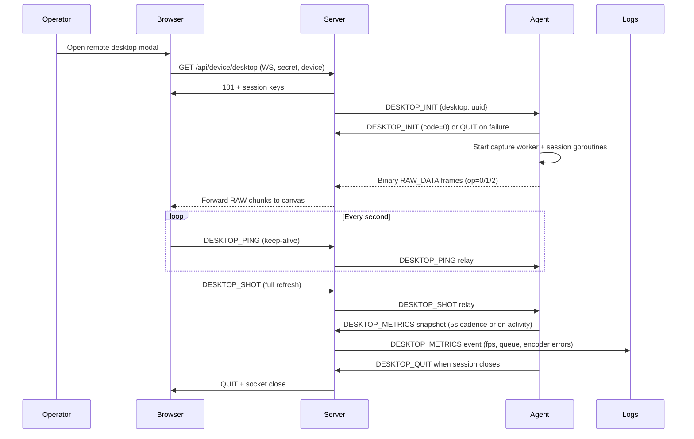

# Remote Desktop Pipeline

Single reference for how the current desktop streaming stack behaves across agent, server, and browser. This captures the as-is implementation before WebRTC/input work begins.

## Architecture Overview

- **Agent (`client/service/desktop`)** – Captures the active display (DXGI/GDI on Windows, screenshot lib elsewhere), diffs frames into 96px blocks, and pushes binary chunks over the control socket. A per-session metrics reporter samples FPS, queue depth, and encoder errors and emits `DESKTOP_METRICS`.
- **Server (`server/handler/desktop`)** – Terminates the browser WebSocket, relays binary diff packets from the agent, handles control actions (`PING`, `SHOT`, `KILL`), and now logs telemetry received via `DESKTOP_METRICS`.
- **Browser (`web/src/components/desktop/desktop.jsx`)** – Opens the WS tunnel, decrypts JSON control frames, reassembles diff chunks into a canvas, exposes manual refresh/fullscreen, and sends pings/shot requests.

```mermaid
flowchart LR
    Browser["Web UI\nReact Canvas"]
    Server["Spark Server\nDesktop Handler"]
    Agent["Spark Agent\nDesktop Service"]
    Browser <-->|WS (service 20)| Server
    Server <-->|Event Packets| Agent
    Agent -->|RAW diff chunks| Server
    Agent -->|DESKTOP_METRICS| Server
```

## Session Lifecycle



## Streaming Path & Packet Format

- **Capture loop** (`worker`) locks to one OS thread, uses DXGI Output Duplication when available (falls back to GDI/screenshot), caps FPS at 24, and keeps a shared `prevDesktop` buffer for diffing.
- **Diff encoding** – Each frame is split into up to `96x96` regions. A `diff` contains one or more blocks; each block is a 12-byte header (length, type, x/y, w/h) plus either raw BGRA or JPEG-compressed bytes (`image/jpeg` @ quality 70). Op codes:
  - `0x00` first chunk of a frame, `0x01` continuation chunks.
  - `0x02` resolution broadcast, `0x03` encrypted JSON control.
- **Transport** – Agent sends binary frames via `common.WSConn.SendData` (service 20). Server simply re-tags the payload and writes to the browser WebSocket (`desktop.srcConn.WriteBinary`). Browser stitches blocks directly into a `<canvas>` 2D context.
- **Back-pressure** – Each session keeps a channel buffer of 5 frame messages. When the buffer is full we drop the oldest entry (viewers skip frames rather than stall) and the metrics reporter increments `queueDrops`.

### WebRTC Pilot (Data Channel Mirroring)

- **Capability flag** – When `SPARK_EXPERIMENTAL_WEBRTC=1` the agent advertises `transports: ["ws-diff", "webrtc"]`. Browsers that see this list build an `RTCPeerConnection` alongside the legacy WebSocket tunnel.
- **spark-diff channel** – The agent creates a pion data channel named `spark-diff`, mirrors every `service=20` payload (diff blocks + resolution broadcasts), and sends them to the browser as raw binary. The web client consumes these bytes via `handleWebRTCFrame` and feeds them into `parseBlocks`, so the existing canvas renderer works unchanged while we test the transport.
- **Media Foundation pipeline (opt-in)** – When `SPARK_EXPERIMENTAL_WEBRTC_ENCODERS=1` and a Windows Media Foundation H.264 encoder is available, the agent now clones the captured RGBA frame, feeds it into the encoder (`client/service/desktop/webrtc/video_pipeline.go`), and broadcasts the resulting RTP samples to every active WebRTC session. Browsers render the `spark-video` track in the hidden `<video>` element while retaining the diff canvas as a fallback.
- **Environment overrides** – Windows agents still hydrate pion via `SPARK_WEBRTC_ICE`, `SPARK_WEBRTC_ICE_USERNAME`, and `SPARK_WEBRTC_ICE_CREDENTIAL`, but browsers now receive per-session TURN credentials when `server/config.json` includes a `webrtc` block. Those creds (plus `token`, `ttlSeconds`, and optional `relayHint`) are injected into `DESKTOP_CAPS.webrtc` so consoles no longer depend on `window.SPARK_WEBRTC_*`, and the HUD now shows the remaining TURN TTL/relay hint so operators can tell when a session is relayed or nearing expiry.
- **Capability payload** – When the agent advertises WebRTC it now embeds `webrtc.iceServers` and `webrtc.dataChannels` inside `DESKTOP_CAPS`. Browsers prefer this payload when constructing the `RTCPeerConnection`, falling back to global overrides only when the capability block is absent.
- **UX surface** – The modal banner now shows `WebRTC: connecting/answer/datachannel-open/error`, and we log the same states through the agent telemetry sink so ops can correlate WebRTC health with watchdog metrics. If the peer connection fails we fall back to the WebSocket diff stream automatically.

## Control, Telemetry, and Failure Handling

- **Control Plane** – Browser emits JSON commands (PING, SHOT, KILL) over op=0x03 frames. Server validates, then forwards to the agent over the existing event UUID. Agent responds with JSON (WARN/QUIT) or full-frame refreshes.
- **Metrics** – Every session now maintains per-interval counters (frames, bytes, diff blocks, queue depth, queue drops, encoder errors). Every 5s—or sooner if new data arrives—the agent sends `DESKTOP_METRICS` containing these raw counters plus the measurement interval and timestamp. Server consumes them and logs derived values (FPS, bandwidth, queue pressure, encoder error streaks) under the `DESKTOP_METRICS` event.
- **Operator HUD** – The server now forwards the derived telemetry back to the browser, and the React modal surfaces it (agent FPS/bandwidth/queue health) so operators can compare local rendering with device-side performance in real time.
- **Policy Sync** – Whenever a session registers or releases a hookbridge policy the agent emits `DESKTOP_POLICY`, a lightweight JSON snapshot describing whether pointer/keyboard input is available plus any force-input/capture overrides. The server simply relays these packets; the browser updates a dedicated `policyState` banner and automatically disables the control toggle if input is blocked by local policy.
- **Failure Modes** – Capture errors (DXGI timeouts, BitBlt failures) increment a shared counter. After 10 consecutive failures the agent calls `quitAllDesktop`, notifies every viewer with a `DESKTOP_QUIT`, and logs the error. Browser automatically warns users if the socket drops or upon explicit QUIT packets.

## Capability Negotiation

- **Schema** – At session creation the agent emits a versioned `DESKTOP_CAPS` packet describing transports (`ws-diff`), capture stack (primary backend, fallbacks, FPS/block settings, current resolution), encoder set (software JPEG @ quality 70), input features, and a nested `policy` block. The policy payload summarizes pointer/keyboard availability, UMH enforcement flags (`forceInput`, `forceCapture`), current connection/session IDs, and timestamps, so new viewers instantly know whether remote control is permitted.
- **Server Handling** – `server/handler/desktop` logs and caches the latest capability payload per session, then forwards it to the browser via JSON so the UI can present operator-friendly summaries.
- **UI Surface** – `web/src/components/desktop/desktop.jsx` listens for `DESKTOP_CAPS`, updates the modal title with capture/encoder tags, and renders a compact banner showing capture backend, encoder pipeline, and active transport. This keeps operators aware of the exact transport path and encoder quality before we introduce WebRTC or hardware codecs.

This document should be kept up to date as we introduce WebRTC transport, input injection, audio, and expanded policy gates.

## Multi-Monitor Control

- **Enumeration API** – Agents expose `DESKTOP_MONITORS`, returning every active display (index, resolution, primary flag) and the currently selected display index. The server simply relays requests between browser and device, adding auditing metadata.
- **Selection Flow** – The browser issues `DESKTOP_SET_MONITOR` with the desired index. The agent reconfigures the capture worker in place (DXGI/GDI or screenshot fallback), resets diff buffers, rebroadcasts resolution packets, and acknowledges the change; no session restart is required.
- **UI** – A dropdown in the desktop modal header shows all displays and allows hot switching. Operators see the active display summarized in the capability HUD, alongside capture/encoder/transport metadata for quick validation.

## Quality Presets

- **Preset Catalog** – The agent exposes three presets (`High Fidelity`, `Balanced`, `Bandwidth Saver`) that tune JPEG quality and FPS caps. Presets are included in every `DESKTOP_CAPS` payload along with the currently selected value.
- **Runtime Switching** – When the browser emits `DESKTOP_SET_QUALITY`, the agent atomically updates capture settings, applies them to the shared worker loop (affecting diff encode quality and capture delay), and acknowledges with the refreshed preset metadata so the UI can reflect the active mode.
- **UI Integration** – A second dropdown in the modal banner lets operators flip between presets while watching the agent FPS/bandwidth HUD, making it easy to trade fidelity for responsiveness without restarting sessions or reinstalling the agent.

## Input Pipeline (Phase 0)

- **Browser Capture Layer** – When operators enable control, the canvas now captures mouse down/up/move/wheel events, normalizes coordinates to remote pixels, and sends them via `DESKTOP_INPUT` messages (throttled with `requestAnimationFrame` for moves).
- **Keyboard & Clipboard** – Key down/up events now travel through the same pipe, landing in the Windows agent where they’re injected via `keybd_event`. Operators can also push/pull clipboard text using new toolbar buttons; the agent writes/reads the OS clipboard via `github.com/atotto/clipboard`.
- **Server Relay** – The desktop handler now enforces a per-session input rate limit (~600 events/sec), surfaces operator warnings when throttling occurs, rolls mouse/keyboard counts into periodic audit summaries, journals SHA-256 digests of every input payload for tamper-evident replay, and then forwards sanitized `DESKTOP_INPUT`, `DESKTOP_CLIPBOARD_PUSH`, and `DESKTOP_CLIPBOARD_PULL` payloads to the agent with the existing session UUID plumbing.
- **Pointer Lock Mode** – Viewers can toggle pointer lock from the toolbar; when engaged, the canvas consumes raw `movementX/Y` deltas, synthesizes relative motion into remote coordinates, and keeps high-DPI scaling accurate so 3D/CAD workflows aren’t constrained by the browser viewport.
- **Pointer Metadata** – Mouse packets now include button bitmasks, click counts, and modifier flags so the agent can distinguish multi-button drags vs. double-clicks and eventually wire advanced gestures without guessing browser behavior.
- **Clipboard Guardrails** – Operators can toggle clipboard sync per session; when disabled, the send/fetch controls gray out so accidental clipboard forwarding is prevented even if the agent supports it. Admins can also set `SPARK_CLIPBOARD_ALLOW_PUSH` / `SPARK_CLIPBOARD_ALLOW_PULL` env vars on the agent to enforce one-way or fully disabled clipboard policies, and the capability payload exposes these flags so the UI disables the corresponding controls automatically. For DLP scenarios, `SPARK_CLIPBOARD_DENY_REGEX` blocks text matching a given pattern on both directions, surfacing a friendly error instead of transmitting the data.
- **Secure Hotkeys** – A dedicated dropdown lets operators fire privileged combos (Ctrl+Alt+Del, Win+L, Ctrl+Shift+Esc); the request rides a new `DESKTOP_SECURE_HOTKEY` RPC, is rate-limited/audited like other input (server logs every attempt and caps at ~3/10s), and surfaces success/failure to the UI once the Windows agent invokes the underlying OS call (SAS/LockWorkStation/Taskmgr).
- **Control Consent** – Before the first time an operator enables remote input, the UI prompts for confirmation (“Enable Remote Control?”). Consent persists for the session but resets when the modal closes, preventing accidental mouse/keyboard takeover.
- **Agent Hooks** – Pointer/keyboard packets are injected via the new `client/service/input` module (SendInput today, UMH later) with micro-throttling on high-frequency pointer move spam. Clipboard packets read/write text, enforce per-direction cooldowns, and send browser-friendly acknowledgements so the UI can keep operators in sync.

## UMH Porting Scaffold (WIP)

- **Hook bridge:** `client/service/desktop/hookbridge` provides a stub Go interface (`Init`, `ApplyPolicy`, `Shutdown`) that future cgo bindings will use to drive the vendored UserModeHook engine. The bridge currently gates itself via `SPARK_EXPERIMENTAL_UMH=1`, logs every policy request, and exposes a telemetry sink hook for the Go runtime.
- **Session metadata helper:** `client/internal/winsession` resolves `ProcessIdToSessionId`, SID, and user name so the agent can tag capability packets with session context and eventually drive session-aware enforcement.
- **Desktop service integration:** `client/service/desktop/desktop.go` now auto-initializes the hook bridge (once per process), attaches session/SID metadata to `DESKTOP_CAPS`, and sends a stub policy message per viewer connection. A Windows-only policy manager (`client/service/desktop/policy.go`) tracks these session policies and automatically unregisters them whenever sessions end (Kill, QUIT, health-check cleanup, or panic teardown), ensuring the future native bridge gets clean lifecycle events.
- **Native bridge scaffold:** `client/native/umh/include/spark_umh.h` plus the new cgo path in `client/service/desktop/hookbridge/hookbridge_native_windows.go` now compile the vendored UMH sources directly into the agent. The bridge (`client/native/umh/src/bridge.cc`) drives UMH’s `InstallHooks`/policy overrides so we enforce `SetWindowDisplayAffinity` + `BlockInput` through the real hook engine while `sparkHookbridgeEmit` streams native telemetry back into the Go layer/desktop HUD for every session.
